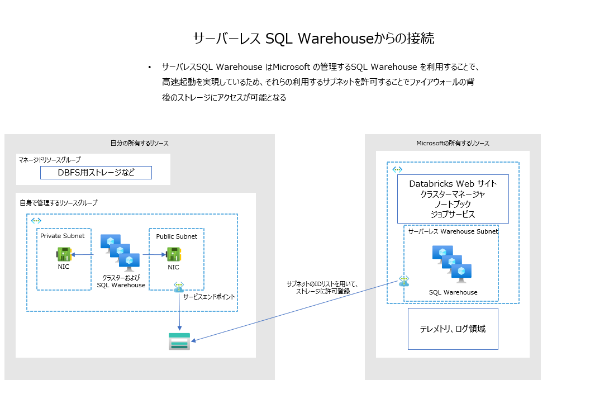

# Databricks Serverless SQL Warehouse のためのサブネット許可設定テンプレート

## 使い方

[サーバレスSQLサブネット](https://learn.microsoft.com/ja-jp/azure/databricks/resources/supported-regions#serverless-sql-subnets)のリストを参考に、パラメータを入力し、deploy Azure ボタンを実行してください。

[サンプルパラメータファイル](./infra/sample_parameters.json)

### 注意

既存のルールを変更しないように、追加専用になっています。すでに登録済みのサブネットを登録することはできないです。

## Deploy to Azure

